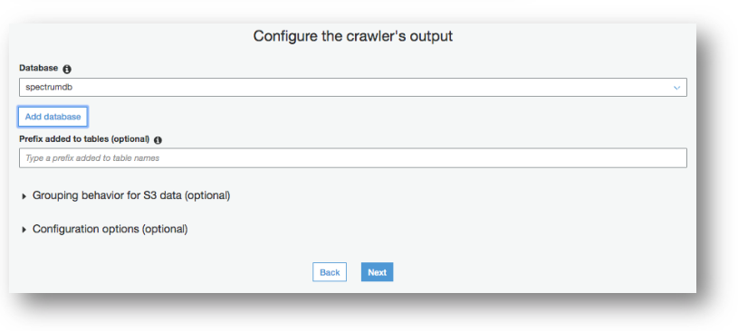
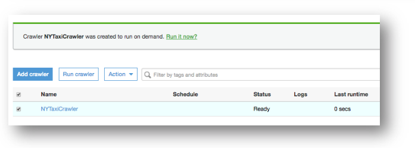
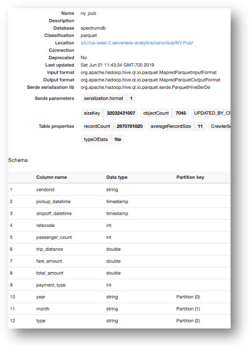

# Lab 5 - Amazon Redshift Spectrum Query Tuning

In this lab, we show you how to diagnose your Redshift Spectrum query performance and optimize performance by leveraging partitions, optimizing storage, and predicate pushdown.

## Contents
* [Before You Begin](#before-you-begin)
* [Querying with Amazon Redshift Spectrum](#querying-with-amazon-redshift-spectrum)
* [Performance Diagnostics](#performance-diagnostics)
* [Optimizing with Partitions](#optimizing-with-partitions)
* [Storage Optimizations](#storage-optimizations)
* [Predicate Pushdown](#predicate-pushdown)
* [Native Redshift versus Redshift with Spectrum](#native-versus-Redshift-with-Spectrum)
* [Before You Leave](#before-you-leave)

## Before You Begin
This lab assumes you have launched a Redshift cluster, and can gather the following information.  If you have not launched a cluster, see [LAB 1 - Creating Redshift Clusters](../lab1/README.md).  
* [Your-Redshift_Hostname]
* [Your-Redshift_Port]
* [Your-Redshift_Username]
* [Your-Redshift_Password]
* [Your-Redshift_Role]
* [Your-AWS-Account_Id]

It also assumes you have access to a configured client tool. For more details on configuring SQL Workbench/J as your client tool, see [Lab 1 - Creating Redshift Clusters : Configure Client Tool](../lab1/README.md#configure-client-tool). As an alternative you can use the Redshift provided online Query Editor which does not require an installation.
```
https://console.aws.amazon.com/redshift/home?#query:
```

## Querying with Amazon Redshift Spectrum
Create a star schema data model by creating dimension tables in your Redshift cluster, and fact tables in S3 as show in the diagram below. 

1. Create the dimension tables by running this script from your client tool.
```
DROP TABLE IF EXISTS customer;
CREATE TABLE customer (
  c_custkey     	integer        not null sortkey,
  c_name        	varchar(25)    not null,
  c_address     	varchar(25)    not null,
  c_city        	varchar(10)    not null,
  c_nation      	varchar(15)    not null,
  c_region      	varchar(12)    not null,
  c_phone       	varchar(15)    not null,
  c_mktsegment      varchar(10)    not null)
diststyle all;

DROP TABLE IF EXISTS dwdate;
CREATE TABLE dwdate (
  d_datekey            integer       not null sortkey,
  d_date               varchar(19)   not null,
  d_dayofweek	      varchar(10)   not null,
  d_month      	    varchar(10)   not null,
  d_year               integer       not null,
  d_yearmonthnum       integer  	 not null,
  d_yearmonth          varchar(8)	not null,
  d_daynuminweek       integer       not null,
  d_daynuminmonth      integer       not null,
  d_daynuminyear       integer       not null,
  d_monthnuminyear     integer       not null,
  d_weeknuminyear      integer       not null,
  d_sellingseason      varchar(13)    not null,
  d_lastdayinweekfl    varchar(1)    not null,
  d_lastdayinmonthfl   varchar(1)    not null,
  d_holidayfl          varchar(1)    not null,
  d_weekdayfl          varchar(1)    not null)
diststyle all;
```

2. Load data into your dimension table by running the following script. You will need to provide an IAM role with the permissions to run the COPY command on your cluster. You can use the IAM role that you identified earlier. This will load the data set from S3 into your Redshift cluster. Expect the script to take a few minutes to complete. The customer and time dimension consists of 3M records, and 2556 records respectively.

```
copy customer from 's3://awssampledbuswest2/ssbgz/customer' 
iam_role 'arn:aws:iam::[Your-Aws-Account-Id]:role/[Your-Redshift_Role]'
gzip region 'us-west-2';

copy dwdate from 's3://awssampledbuswest2/ssbgz/dwdate' 
iam_role 'arn:aws:iam::[Your-Aws-Account-Id]:role/[Your-Redshift_Role]'
gzip region 'us-west-2';
```

3. Next, create an *External Schema* that references datasets that reside outside of your Redshift cluster. Define this schema by running the following command. You will need to provide an IAM role with the permissions to read S3 date from your cluster.  This should be the same role used above in the COPY command. Redshift stores the meta-data that describes your external databases and schemas in the AWS Glue data catalog by default. Once created, you can view the schema from Glue or Athena.

```
CREATE EXTERNAL SCHEMA clickstream 
from data catalog database 'clickstream' 
iam_role 'arn:aws:iam::[Your-Aws-Account-Id]:role/[Your-Redshift_Role]'
CREATE EXTERNAL DATABASE IF NOT EXISTS;
```

* Use the AWS Glue Crawler to create your external table clickstream.clickstream-csv10 and clickstream.clickstream-parquet1  under locations s3://redshift-spectrum-bigdata-blog-datasets/clickstream-csv10 and s3://redshift-spectrum-bigdata-blog-datasets/clickstream-parquet1 respectively.

	1. Navigate to the **Glue Crawler Page**. https://console.aws.amazon.com/glue/home?#catalog:tab=crawlers
	
	1. Click on *Add Crawler*, and enter the crawler name *NYTaxiCrawler* and click *Next*.
	
	1. Select *Data stores* as the source type and click *Next*.
	
	1. Choose *S3* as the data store and the include path of *s3://us-west-2.serverless-analytics/canonical/NY-Pub*
	
	1. *Choose an existing IAM Role* and select [Your-Glue_Role].
	
	1. Select *Run on demand* for the frequency.
	
	1. Click on *Add database* and enter the Database of *spectrumdb*
	
	1. Select all remaining defaults. Once the Crawler has been created, click on *Run Crawler*.
	
	1. Once the Crawler has completed its run, you will see a new table in the Glue Catalog. https://console.aws.amazon.com/glue/home?#catalog:tab=tables
	
	1. Click on the *ny_pub* table, notice the recordCount of 2.87 billion. 
	


## Before You Leave
If you are done using your cluster, please think about decommissioning it to avoid having to pay for unused resources.
