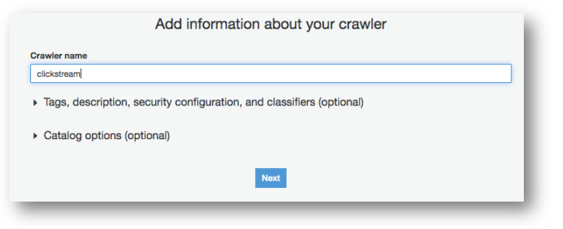
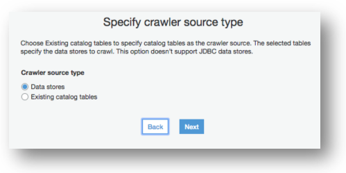
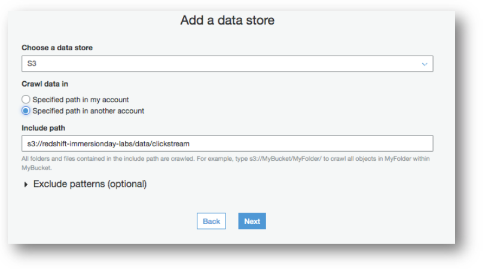
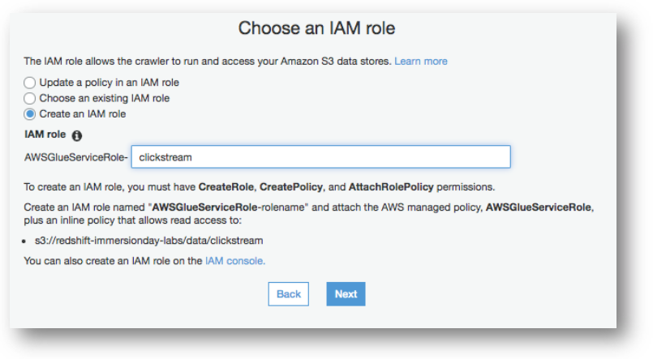
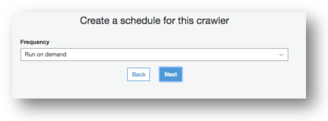
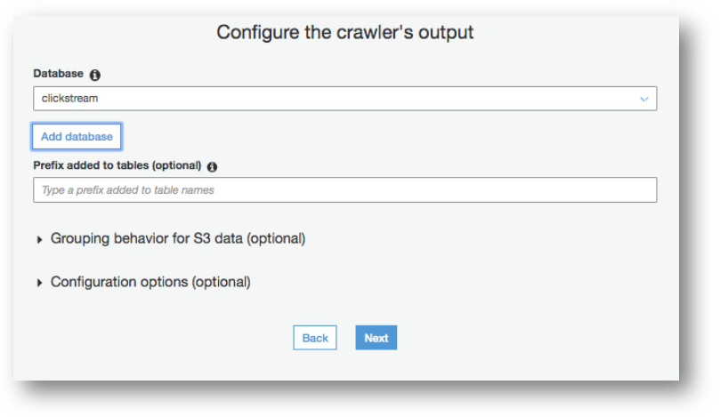
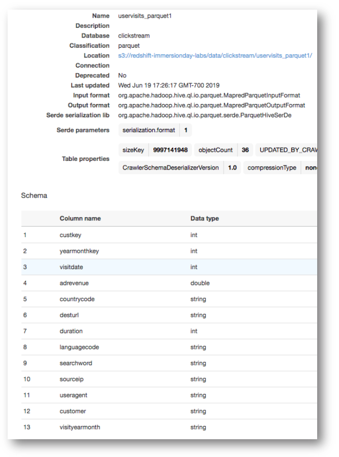
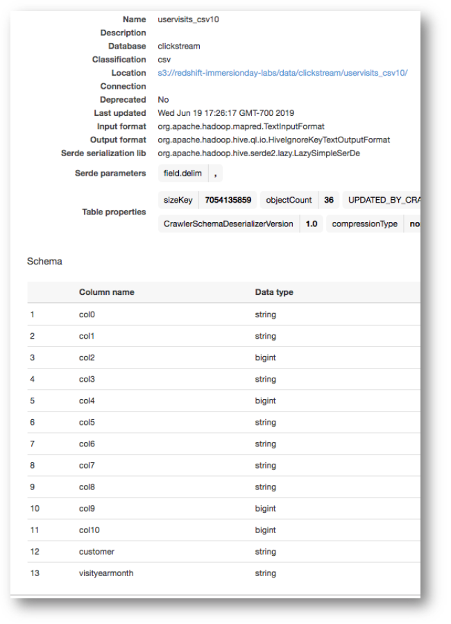

# Lab 5 - Amazon Redshift Spectrum Query Tuning

In this lab, we show you how to diagnose your Redshift Spectrum query performance and optimize performance by leveraging partitions, optimizing storage, and predicate pushdown.

## Contents
* [Before You Begin](#before-you-begin)
* [Querying with Amazon Redshift Spectrum](#querying-with-amazon-redshift-spectrum)
* [Performance Diagnostics](#performance-diagnostics)
* [Optimizing with Partitions](#optimizing-with-partitions)
* [Storage Optimizations](#storage-optimizations)
* [Predicate Pushdown](#predicate-pushdown)
* [Native Redshift versus Redshift with Spectrum](#native-redshift-versus-redshift-with-spectrum)
* [Before You Leave](#before-you-leave)

## Before You Begin
This lab assumes you have launched a Redshift cluster, and can gather the following information.  If you have not launched a cluster, see [LAB 1 - Creating Redshift Clusters](../lab1/README.md).  
* [Your-Redshift_Hostname]
* [Your-Redshift_Port]
* [Your-Redshift_Username]
* [Your-Redshift_Password]
* [Your-Redshift_Role]
* [Your-AWS-Account_Id]
* [Your-Glue_Role]

It also assumes you have access to a configured client tool. For more details on configuring SQL Workbench/J as your client tool, see [Lab 1 - Creating Redshift Clusters : Configure Client Tool](../lab1/README.md#configure-client-tool). As an alternative you can use the Redshift provided online Query Editor which does not require an installation.
```
https://console.aws.amazon.com/redshift/home?#query:
```

## Querying with Amazon Redshift Spectrum
Create a star schema data model by creating dimension tables in your Redshift cluster, and fact tables in S3 as show in the diagram below. 

1. Create the dimension tables by running this script from your client tool.
```sql
DROP TABLE IF EXISTS customer;
CREATE TABLE customer (
  c_custkey     	integer        not null sortkey,
  c_name        	varchar(25)    not null,
  c_address     	varchar(25)    not null,
  c_city        	varchar(10)    not null,
  c_nation      	varchar(15)    not null,
  c_region      	varchar(12)    not null,
  c_phone       	varchar(15)    not null,
  c_mktsegment      varchar(10)    not null)
diststyle all;

DROP TABLE IF EXISTS dwdate;
CREATE TABLE dwdate (
  d_datekey            integer       not null sortkey,
  d_date               varchar(19)   not null,
  d_dayofweek	      varchar(10)   not null,
  d_month      	    varchar(10)   not null,
  d_year               integer       not null,
  d_yearmonthnum       integer  	 not null,
  d_yearmonth          varchar(8)	not null,
  d_daynuminweek       integer       not null,
  d_daynuminmonth      integer       not null,
  d_daynuminyear       integer       not null,
  d_monthnuminyear     integer       not null,
  d_weeknuminyear      integer       not null,
  d_sellingseason      varchar(13)    not null,
  d_lastdayinweekfl    varchar(1)    not null,
  d_lastdayinmonthfl   varchar(1)    not null,
  d_holidayfl          varchar(1)    not null,
  d_weekdayfl          varchar(1)    not null)
diststyle all;
```

2. Load data into your dimension table by running the following script. You will need to provide an IAM role with the permissions to run the COPY command on your cluster. You can use the IAM role that you identified earlier. This will load the data set from S3 into your Redshift cluster. Expect the script to take a few minutes to complete. The customer and time dimension consists of 3M records, and 2556 records respectively.

```sql
copy customer from 's3://awssampledbuswest2/ssbgz/customer' 
iam_role 'arn:aws:iam::[Your-Aws-Account-Id]:role/[Your-Redshift_Role]'
gzip region 'us-west-2';

copy dwdate from 's3://awssampledbuswest2/ssbgz/dwdate' 
iam_role 'arn:aws:iam::[Your-Aws-Account-Id]:role/[Your-Redshift_Role]'
gzip region 'us-west-2';
```

3. Next, create an *External Schema* that references datasets that reside outside of your Redshift cluster. Define this schema by running the following command. You will need to provide an IAM role with the permissions to read S3 date from your cluster.  This should be the same role used above in the COPY command. Redshift stores the meta-data that describes your external databases and schemas in the AWS Glue data catalog by default. Once created, you can view the schema from Glue or Athena.

```sql
CREATE EXTERNAL SCHEMA clickstream 
from data catalog database 'clickstream' 
iam_role 'arn:aws:iam::[Your-Aws-Account-Id]:role/[Your-Redshift_Role]'
CREATE EXTERNAL DATABASE IF NOT EXISTS;
```

4. Use the AWS Glue Crawler to create your external table clickstream.clickstream-csv10 and clickstream.clickstream-parquet1  under locations s3://redshift-spectrum-bigdata-blog-datasets/clickstream-csv10 and s3://redshift-spectrum-bigdata-blog-datasets/clickstream-parquet1 respectively.

	1. Navigate to the **Glue Crawler Page**. https://console.aws.amazon.com/glue/home?#catalog:tab=crawlers 
	
	1. Click on *Add Crawler*, and enter the crawler name *clickstream* and click *Next*. 
	
	1. Select *Data stores* as the source type and click *Next*. 
	
	1. Choose *S3* as the data store and the include path of *s3://redshift-immersionday-labs/data/clickstream* 
	
	1. *Choose an existing IAM Role* and select a Role which Glue can assume and which has access to S3.  If you don't have a Glue Role, you can also select *Create an IAM role*. 
	
	1. Select *Run on demand* for the frequency. 
	
	1. Select the Database *clickstream* from the list. 
	
	1. Select all remaining defaults. Once the Crawler has been created, click on *Run Crawler*. 
	
	1. Once the Crawler has completed its run, you will see two new tables in the Glue Catalog. https://console.aws.amazon.com/glue/home?#catalog:tab=tables 
	
	1. Click on the *uservisits_parquet1* table. Notice the recordCount of 2.87 billion. 
	
	1. Navigate back to the Glue Catalog https://console.aws.amazon.com/glue/home?#catalog:tab=tables.  Click on the *uservisits_csv* table. Notice the column names have not been set. 
	
	1. Click on *Edit Schema* and enter the column names as follows and click *Save*. 
	

5. Navigate back to your SQL Client tool and run the query below. This query performs a join between dimension tables in Redshift, and the clickstream fact table in S3 effectively blending data from the data Lake and data warehouse. This query returns the total ad revenue in the last 3 months of our dataset by market segment for customers 1 to 3. The ad revenue data originates from S3 while the customer and time attributes like market segment originate from the dimension tables in Redshift.

```sql
SELECT c.c_name, c.c_mktsegment, t.prettyMonthYear, SUM(uv.adRevenue)
FROM clickstream.uservisits_csv10 as uv
RIGHT OUTER JOIN customer as c ON c.c_custkey = uv.custKey
INNER JOIN (
  SELECT DISTINCT d_yearmonthnum, (d_month||','||d_year) as prettyMonthYear 
  FROM dwdate 
  WHERE d_yearmonthnum >= 199810) as t ON uv.yearMonthKey = t.d_yearmonthnum
WHERE c.c_custkey <= 3
GROUP BY c.c_name, c.c_mktsegment, t.prettyMonthYear, uv.yearMonthKey 
ORDER BY c.c_name, c.c_mktsegment, uv.yearMonthKey  ASC
```

Expect this query to take a few minutes to complete as nearly 3.8B records will be accessed. The results of the query should be as follows:

|c_name|c_mktsegment|Prettymonthyear|totalrevenue|
|---|---|---|---|
|Customer#000000001|BUILDING|October,1998|3596847.84|
|Customer#000000001|BUILDING|November,1998|3776957.04|
|Customer#000000001|BUILDING|December,1998|3674480.43|
|Customer#000000002|AUTOMOBILE|October,1998|3593281.28|
|Customer#000000002|AUTOMOBILE|November,1998|3777930.64|
|Customer#000000002|AUTOMOBILE|December,1998|3671834.14|
|Customer#000000003|AUTOMOBILE|October,1998|3596234.31|
|Customer#000000003|AUTOMOBILE|November,1998|3776715.02|
|Customer#000000003|AUTOMOBILE|December,1998|3674360.28|


## Performance Diagnostics
There are two key utilities that provide visibility into Redshift Spectrum:

* [EXPLAIN](http://docs.aws.amazon.com/redshift/latest/dg/r_EXPLAIN.html) - Provides the query execution plan, which includes info around what processing is pushed down to Spectrum. Steps in the plan that include the prefix S3 are executed on Spectrum; for instance, the plan for the query above has a step “S3 Seq Scan clickstream.uservisits_csv10” indicating that Spectrum performs a scan on S3 as part of the query execution.

* [SVL_S3QUERY_SUMMARY](http://docs.aws.amazon.com/redshift/latest/dg/r_SVL_S3QUERY_SUMMARY.html) - Provides statistics for Redshift Spectrum queries are stored in this table. While the execution plan presents cost estimates, this table stores actual statistics of past query runs.  

1. Run the following query on the SVL_S3QUERY_SUMMARY table:
```sql
select elapsed, s3_scanned_rows, s3_scanned_bytes, 
  s3query_returned_rows, s3query_returned_bytes, files, avg_request_parallelism 
from svl_s3query_summary 
where query = pg_last_query_id() 
order by query,segment;
```

The query should return results similar to the following:

|elapsed|s3_scanned_rows|s3_scanned_bytes|s3query_returned_rows|s3query_returned_bytes|files|avg_request_parallelism|
|---|---|---|---|---|---|---|
|209773697|3758774345|6.61358E+11|66270117|1060321872|5040|9.77|

The diagnostics reveal why our query took so long. For instance, *s3_scanned_row* reveals that the query scans nearly 3.8B records, which is the entire data set. 

2. Run the same Redshift Spectrum query again, but with EXPLAIN
```sql
EXPLAIN 
SELECT c.c_name, c.c_mktsegment, t.prettyMonthYear, SUM(uv.adRevenue)
FROM clickstream.uservisits_csv10 as uv
RIGHT OUTER JOIN customer as c ON c.c_custkey = uv.custKey
INNER JOIN (
  SELECT DISTINCT d_yearmonthnum, (d_month||','||d_year) as prettyMonthYear 
  FROM dwdate WHERE d_yearmonthnum >= 199810) as t ON uv.yearMonthKey = t.d_yearmonthnum
WHERE c.c_custkey <= 3
GROUP BY c.c_name, c.c_mktsegment, t.prettyMonthYear, uv.yearMonthKey 
ORDER BY c.c_name, c.c_mktsegment, uv.yearMonthKey  ASC
```

The output will look similar to the example below. Don’t worry about understanding the details of the query plan at this time.  

```
QUERY PLAN
XN Merge  (cost=1141056800867.31..1141056801917.31 rows=420000 width=78)
Merge Key: c.c_name, c.c_mktsegment, uv.yearmonthkey
->  XN Network  (cost=1141056800867.31..1141056801917.31 rows=420000 width=78)
Send to leader
->  XN Sort  (cost=1141056800867.31..1141056801917.31 rows=420000 width=78)
Sort Key: c.c_name, c.c_mktsegment, uv.yearmonthkey
->  XN HashAggregate  (cost=141056760589.25..141056761639.25 rows=420000 width=78)
->  XN Hash Join DS_DIST_ALL_NONE  (cost=37.34..141056596142.86 rows=13155711 width=78)
Hash Cond: ("outer".yearmonthkey = "inner".d_yearmonthnum)
->  XN Hash Join DS_DIST_ALL_NONE  (cost=4.50..141051766084.98 rows=375877435 width=46)
Hash Cond: ("outer".custkey = "inner".c_custkey)
->  XN Partition Loop  (cost=0.00..94063327993.62 rows=3758774345000 width=16)
->  XN Seq Scan PartitionInfo of clickstream.uservisits_csv10 uv  (cost=0.00..10.00 rows=1000 width=0)
->  XN S3 Query Scan uv  (cost=0.00..93969358.62 rows=3758774345 width=16)
->  S3 Seq Scan clickstream.uservisits_csv10 uv location:"s3://redshift-spectrum-datastore-csv10" format:TEXT  (cost=0.00..56381615.17 rows=3758774345 width=16)
Filter: ((custkey <= 3) AND (yearmonthkey >= 199810))
->  XN Hash  (cost=3.75..3.75 rows=300 width=38)
->  XN Seq Scan on customer c  (cost=0.00..3.75 rows=300 width=38)
Filter: (c_custkey <= 3)
->  XN Hash  (cost=32.82..32.82 rows=7 width=36)
->  XN Subquery Scan t  (cost=0.00..32.82 rows=7 width=36)
->  XN Unique  (cost=0.00..32.75 rows=7 width=18)
->  XN Seq Scan on dwdate  (cost=0.00..32.43 rows=64 width=18)
Filter: (d_yearmonthnum >= 199810)
```

The takeaway is that the query plan reveals how Redshift Spectrum is leverage in the query. The linke below indicates that Redshift Spectrum is leveraged as part of the query execution to perform a scan. It also reveals that partitions were not used. We will explore this in more detail in the next part of the lab.
```
->  S3 Seq Scan clickstream.uservisits_csv10 uv location:"s3://redshift-spectrum-datastore-csv10" format:TEXT  (cost=0.00..56381615.17 rows=3758774345 width=16)
```

## Optimizing with Partitions

In this section, you will learn about partitions, and how they can be used to improve the performance of your Redshift Spectrum queries.  Partitioning is a key means to improving scan efficiency. Previously, we ran the glue crawler which created our external tables along with partitions. Navigate back to the Glue Catalog https://console.aws.amazon.com/glue/home?#catalog:tab=tables.  Click on the *uservisits_csv10* table. The columns *customer* and *visityearmonth* are set as the partition keys.


If you have interest in understanding the details of how partitions were setup, refer to the [documentation](http://docs.aws.amazon.com/redshift/latest/dg/c-spectrum-external-tables.html).  You may explore the S3 buckets that are serving our Redshift Spectrum datasets by navigating to the following location: 
```
https://s3.console.aws.amazon.com/s3/buckets/redshift-immersionday-labs/data/clickstream/uservisits_csv10/
```

The entire 3.8 billion-row dataset is organized as a collection of large files where each file contains data exclusive to a particular customer and month in a year. This allows you to partition your data into logical subsets by customer and year/month as exemplified above. With partitions, the query engine can target a subset of files:
* Only for specific customers
* Only data for specific months
* A combination of specific customers and year/months

Take note that the right choice of partitions is dependent on your workload. Partitions should be selected based on the primary queries you want to optimize, and your data profile. For those implementing their own clickstream analytics, a partition scheme like year/month/region often makes sense. The choice of using customer in the partition scheme isn’t optimal for a use case where there is a very large number of customers, and little data for each one. The data set, and scheme used in this example is a practical one for scenarios like a multi-tenant ad-tech platform, or an IoT platform. In these cases, there are a moderate number of customers (tenants), and a lot of data per customer.

1. Observe the effects of leveraging partitioning on our query by running the following query.
```sql
SELECT c.c_name, c.c_mktsegment, t.prettyMonthYear, SUM(uv.adRevenue)
FROM clickstream.uservisits_csv10 as uv
RIGHT OUTER JOIN customer as c ON c.c_custkey = uv.customer
INNER JOIN 
  (SELECT DISTINCT d_yearmonthnum, (d_month||','||d_year) as prettyMonthYear 
   FROM dwdate 
   WHERE d_yearmonthnum >= 199810) as t ON uv.yearMonthKey = t.d_yearmonthnum
WHERE c.c_custkey <= 3
GROUP BY c.c_name, c.c_mktsegment, t.prettyMonthYear, uv.yearMonthKey 
ORDER BY c.c_name, c.c_mktsegment, uv.yearMonthKey  ASC
```

The join condition from the previous query has been modified. Instead of joining on the synthetic key, *custKey*, we use the partition key, *customer*, that we created as part of the data modeling process. This query should run approximately **2X faster** than the previous. 

2. Run the same Redshift Spectrum query again, but with EXPLAIN. Unlike before, you should see a Filter clause as part of the PartitionInfo scan that indicates partition pruning is executed as part of the query plan:

```
->  XN Seq Scan PartitionInfo of clickstream.uservisits_csv10 uv  (cost=0.00..12.50 rows=334 width=4)
         Filter: ((customer <= 3) AND (subplan 4: (customer = $2)))
```

3. Re-run the SVL_S3QUERY_SUMMARY query:
```sql
select elapsed, s3_scanned_rows, s3_scanned_bytes, 
  s3query_returned_rows, s3query_returned_bytes, files, avg_request_parallelism 
from svl_s3query_summary 
where query = pg_last_query_id() 
order by query,segment;
```

You should observe the following results:

|elapsed|s3_scanned_rows|s3_scanned_bytes|s3query_returned_rows|s3query_returned_bytes|files|avg_request_parallelism|
|---|---|---|---|---|---|---|
|113561847|1898739653|3.34084E+11|66270117|795241404|2520|9.71|


Note that *s3_scanned_rows* reveals that the rows scanned has been halved when compared with the previous query. This explains why our query ran roughly twice as fast.

The results are due to the fact that our data is evenly distributed across all customers, and by querying 3 of 6 customers with our customer partition key, the database engine is able to intelligently scan the subset of data containing customers 1,2 and 3 instead of the entire data set. However, the scan is still very inefficient, and we can benefit from utilizing our year/month partition key as well.

4. Run the query below:
```sql
SELECT c.c_name, c.c_mktsegment, t.prettyMonthYear, SUM(uv.adRevenue)
FROM clickstream.uservisits_csv10 as uv
RIGHT OUTER JOIN customer as c ON c.c_custkey = uv.customer
INNER JOIN (
  SELECT DISTINCT d_yearmonthnum, (d_month||','||d_year) as prettyMonthYear 
  FROM dwdate 
  WHERE d_yearmonthnum >= 199810) as t ON uv.visitYearMonth = t.d_yearmonthnum
WHERE c.c_custkey <= 3
GROUP BY c.c_name, c.c_mktsegment, t.prettyMonthYear, uv.yearMonthKey 
ORDER BY c.c_name, c.c_mktsegment, uv.yearMonthKey  ASC
```

The join condition from the previous query has been modified. Instead of joining on the synthetic key, *yearMonthKey*, we use the partition key, *visitYearMonth*. Our latest query utilizes both customer and time partitions and if you run this query a few times, you should see execution time in the range of 8s, which is a **22.5X improvement** on our original query! 

4. Re-run the SVL_S3QUERY_SUMMARY query:
```sql
select elapsed, s3_scanned_rows, s3_scanned_bytes, 
  s3query_returned_rows, s3query_returned_bytes, files, avg_request_parallelism 
from svl_s3query_summary 
where query = pg_last_query_id() 
order by query,segment;
```

Upon reviewing the statistics for this query, you should observe that Redshift Spectrum scans and returns the exact number of rows (66,270,117) required to compute the query.

|elapsed|s3_scanned_rows|s3_scanned_bytes|s3query_returned_rows|s3query_returned_bytes|files|avg_request_parallelism|
|---|---|---|---|---|---|---|
|7124877|66270117|11660676734|66270117|795241404|90|5.87

## Storage Optimizations
Redshift Spectrum performs processing through large-scale infrastructure external to your Redshift cluster. It is optimized for performing large scans and aggregations on S3; in fact, with the proper optimizations, Redshift Spectrum may even out-perform a small to medium size Redshift cluster on these types of workloads. There are two important variables to consider for optimizing large scans and aggregations:
* **File size and count** - As a general rule, use files sizes between 50-500MB for non-splittable files, this is optimal for Redshift Spectrum. However, the number of files operating on a query is directly correlated with the parallelism achievable by a query. There is an inverse relationship between file size and count: the bigger the files, the fewer files there are for the same dataset. Consequently, there is a trade-off between optimizing for object read performance, and the amount of parallelism achievable on a particular query. Large files are best for large scans as the query likely operates on sufficiently large number of files. For queries that are more selective and for which fewer files are operating, you may find that smaller files allow for more parallelism.
* **Data format** Redshift Spectrum supports various data formats. Columnar formats like Parquet can sometimes lead to substantial performance benefits by providing compression and more efficient I/O for certain workloads. Generally, format types like Parquet should be used for query workloads involving large scans, and high attribute selectivity. Again, there are trade-offs as formats like Parquet require more compute power to process than plaintext. For queries on smaller subsets of data, the I/O efficiency benefit of Parquet is diminished. At some point, Parquet may perform the same or slower than plaintext. Latency, compression rates, and the trade-off between user experience and cost should drive your decision. In most cases, formats like Parquet is optimal.

To help illustrate how Spectrum performs on these large aggregation workloads, let’s consider a basic query that aggregates the entire 3.7B+ record dataset on Redshift Spectrum, and compared that with running the query exclusively on Redshift: 
```sql
SELECT uv.custKey, COUNT(uv.custKey)
FROM <your clickstream table> as uv
GROUP BY uv.custKey
ORDER BY uv.custKey ASC
```

In the interest of time, we won’t go through this exercise in the lab; nonetheless, it is helpful to understand the results of running this test.

For the Redshift-only test case, the clickstream data is loaded, and distributed evenly across all nodes (even distribution style) with optimal column compression encodings prescribed by Redshift’s ANALYZE command. 

The Redshift Spectrum test case utilizes a Parquet data format with one file containing all the data for a particular customer in a month; this results in files mostly in the range of 220-280MB, and in effect, is the largest file size for this partitioning scheme. If you run tests with the other datasets provided, you will see that this data format and size is optimal and will out-perform others by 60X+.

Take heed that the presented quantifications shouldn’t be applied generically as performance differences will vary depending on scenario. Instead take note of the testing strategy, the evidence, and the characteristics of the workload where Spectrum is likely to yield performance benefits.

The chart below compares the query execution time for the two scenarios. The results indicate that you will need to pay for 12 X DC1.Large nodes to get performance comparable to using Spectrum with the support of a small Redshift cluster in this particular scenario.  Also, note that the performance for Spectrum plateaus in the chart above. If the query involved aggregating data from more files, we would see a continued linear improvement in performance as well.

<p align="center">
  <b>Chart 1: Native Redshift vs. Spectrum Agg Performance by Node Count</b>
  
</p>


## Predicate Pushdown

In the last section, we learned that Spectrum excels at performing large aggregations. In this section, we’ll experiment the results of pushing more work down to Redshift Spectrum.

1. Run the following query. After running this query a few times, you should observe execution times in the range of 4 seconds.
```sql
SELECT c.c_name, c.c_mktsegment, t.prettyMonthYear, uv.totalRevenue
FROM (
  SELECT customer, visitYearMonth, SUM(adRevenue) as totalRevenue 
  FROM clickstream.uservisits_parquet1
  WHERE customer <= 3 and visitYearMonth >= 199810
  GROUP BY  customer, visitYearMonth) as uv
RIGHT OUTER JOIN customer as c ON c.c_custkey = uv.customer
INNER JOIN (
  SELECT DISTINCT d_yearmonthnum, (d_month||','||d_year) as prettyMonthYear 
  FROM dwdate WHERE d_yearmonthnum >= 199810) as t ON uv.visitYearMonth = t.d_yearmonthnum)
ORDER BY c.c_name, c.c_mktsegment, uv.visitYearMonth ASC;
```

This query improves on our previous one in a couple of ways. 

* We are querying the clickstream.uservisits_parquet1 table instead of clickstream.uservisits_csv10. These two tables contain the same data set, but they have been processed in different ways. The table clickstream.uservisits_parquet1 contains data in parquet format. Parquet is a columnar format, and yields I/O benefits for analytical workloads by providing compression and efficient retrieval of the attributes that are selected by the queries. Furthermore, the “1” vs “10” suffix indicates that all the data for each partition is stored in a single file instead of ten files like the CSV data set. The latter case has less overhead involved in processing large scans and aggregations.

* The aggregation work has been pushed down to Redshift Spectrum. When we analyzed the query plan previously, we observed that Spectrum is used for scanning. When you analyze the above query, you will see that aggregations are also performed at the Spectrum layer.

2. Re-run the SVL_S3QUERY_SUMMARY query:
```sql
select elapsed, s3_scanned_rows, s3_scanned_bytes, 
  s3query_returned_rows, s3query_returned_bytes, files, avg_request_parallelism 
from svl_s3query_summary 
where query = pg_last_query_id() 
order by query,segment;
```

You obtain the following results:

|elapsed|s3_scanned_rows|s3_scanned_bytes|s3query_returned_rows|s3query_returned_bytes|files|avg_request_parallelism|
|---|---|---|---|---|---|---|
|1990509|66270117|531159030|9|72|9|0.88|

The statistics reveal the source of some of the performance improvements:

* The bytes scanned is reduced even though the same number of rows are scanned as a result of compression.
* The number of rows returned is reduced to 9 from ~66.3M. This results in only 72 bytes returned from the Spectrum layer versus 795MBs. This is the result of pushing the aggregation down to the Spectrum layer. Our data is stored at the day-level granularity, and our query rolls that up to the month-level. By pushing the aggregation down to the Spectrum fleet, we only need to return 9 records that aggregate ad revenue up to the month level so that they can be joined with the required dimension attributes.

3. Run the query again with EXPLAIN:

The query plan should include an *S3 Aggregate* step, which indicates that the Spectrum layer offloads the aggregation processing for this query.

```
QUERY PLAN
XN Merge  (cost=1000094008880.16..1000094008880.18 rows=7 width=78)
  Merge Key: c.c_name, c.c_mktsegment, uv.visityearmonth
  ->  XN Network  (cost=1000094008880.16..1000094008880.18 rows=7 width=78)
        Send to leader
        ->  XN Sort  (cost=1000094008880.16..1000094008880.18 rows=7 width=78)
              Sort Key: c.c_name, c.c_mktsegment, uv.visityearmonth
              ->  XN Hash Join DS_DIST_ALL_NONE  (cost=94008878.97..94008880.06 rows=7 width=78)
                    Hash Cond: ("outer".customer = "inner".c_custkey)
                    ->  XN Hash Join DS_DIST_ALL_NONE  (cost=93971378.97..93971379.61 rows=7 width=48)
                          Hash Cond: ("outer".visityearmonth = "inner".d_yearmonthnum)
                          ->  XN Subquery Scan uv  (cost=93971346.13..93971346.42 rows=23 width=16)
                                ->  XN HashAggregate  (cost=93971346.13..93971346.19 rows=23 width=16)
                                      ->  XN Partition Loop  (cost=93969358.63..93970506.13 rows=112000 width=16)
                                            ->  XN Seq Scan PartitionInfo of clickstream.uservisits_parquet1  (cost=0.00..17.50 rows=112 width=8)
                                                  Filter: ((customer <= 3) AND (visityearmonth >= 199810) AND (visityearmonth >= 199810))
                                            ->  XN S3 Query Scan uservisits_parquet1  (cost=46984679.32..46984689.32 rows=1000 width=8)
                                                  ->  S3 Aggregate  (cost=46984679.32..46984679.32 rows=1000 width=8)
                                                        ->  S3 Seq Scan clickstream.uservisits_parquet1 location:"s3://redshift-spectrum-datastore-parquet1" format:PARQUET  (cost=0.00..37587743.45 rows=3758774345 width=8)
                          ->  XN Hash  (cost=32.82..32.82 rows=7 width=36)
                                ->  XN Subquery Scan t  (cost=0.00..32.82 rows=7 width=36)
                                      ->  XN Unique  (cost=0.00..32.75 rows=7 width=18)
                                            ->  XN Seq Scan on dwdate  (cost=0.00..32.43 rows=64 width=18)
                                                  Filter: (d_yearmonthnum >= 199810)
                    ->  XN Hash  (cost=30000.00..30000.00 rows=3000000 width=38)
                          ->  XN Seq Scan on customer c  (cost=0.00..30000.00 rows=3000000 width=38)
```

## Native Redshift versus Redshift with Spectrum

At this point, you might be asking yourself, why would I ever not use Spectrum? Well, you still get additional value from loading data into Redshift. In fact, it turns out that our last query runs even faster when executed exclusively in native Redshift. Running a full test is beyond the time we have for the lab, so let’s review test results that compares running the last query with Redshift Spectrum versus exclusively with Redshift on various cluster sizes.

As a rule of thumb, queries that aren’t dominated by I/O and involve multiple joins are better optimized in native Redshift.  Furthermore, the variability in latency in native Redshift is significantly lower. For use cases where you have tight performance SLAs on queries, you may want to consider using Redshift exclusively to support those queries.

On the other hand, when you have the need to perform large scans, you could benefit from the best of both worlds: higher performance at lower cost. For instance, imagine we needed to enable our business analysts to interactively discover insights across a vast amount of historical data. 

1. Instead of running our previous query on 3 months of data, let’s perform the analysis on 7-years. Unlike our previous queries, the time range filter starts at January, 1992 instead of October, 1998. This query should run in under 10 seconds after it is executed a few times.
```sql
SELECT c.c_name, c.c_mktsegment, t.prettyMonthYear, uv.totalRevenue
FROM (
  SELECT customer, visitYearMonth, SUM(adRevenue) as totalRevenue
  FROM clickstream.uservisits_parquet1
  WHERE customer <= 3 and visitYearMonth >= 199201
  GROUP BY  customer, visitYearMonth) as uv
RIGHT OUTER JOIN customer as c ON c.c_custkey = uv.customer
INNER JOIN (
  SELECT DISTINCT d_yearmonthnum, (d_month||','||d_year) as prettyMonthYear 
  FROM dwdate 
  WHERE d_yearmonthnum >= 199201) as t
ON uv.visitYearMonth = t.d_yearmonthnum)
ORDER BY c.c_name, c.c_mktsegment, uv.visitYearMonth ASC;
```

2. Inspect the SVL_S3QUERY_SUMMARY again by running the query:
```sql
select elapsed, s3_scanned_rows, s3_scanned_bytes, 
  s3query_returned_rows, s3query_returned_bytes, files, avg_request_parallelism 
from svl_s3query_summary 
where query = pg_last_query_id() 
order by query,segment;
```

You should observe the results below. Note that this query scans nearly 1.9B records, which is half the data set to aggregate data across 7-years. 

|elapsed|s3_scanned_rows|s3_scanned_bytes|s3query_returned_rows|s3query_returned_bytes|files|avg_request_parallelism|
|---|---|---|---|---|---|---|
|9005338|1898739653|15217906256|252|2016|252|8.15|

This is a lot of data to process, yet the query runs in under 10 seconds. This is substantially faster that the queries we ran at the start of the lab, which queried the same result set. The difference in performance is a result of the improvements we made to the data format, size and pushing the aggregation work down to the Spectrum layer.

## Before You Leave
If you are done using your cluster, please think about decommissioning it to avoid having to pay for unused resources.
